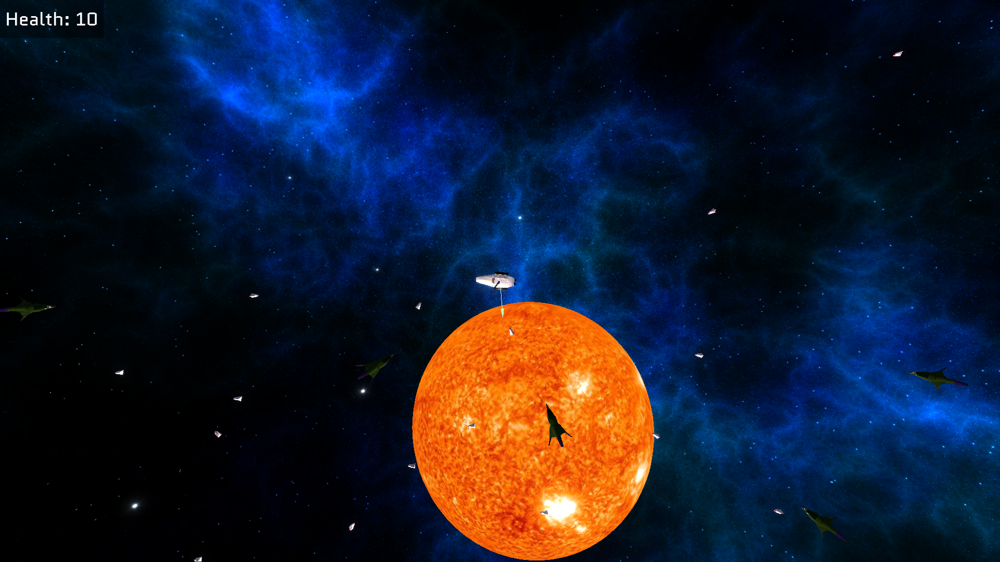
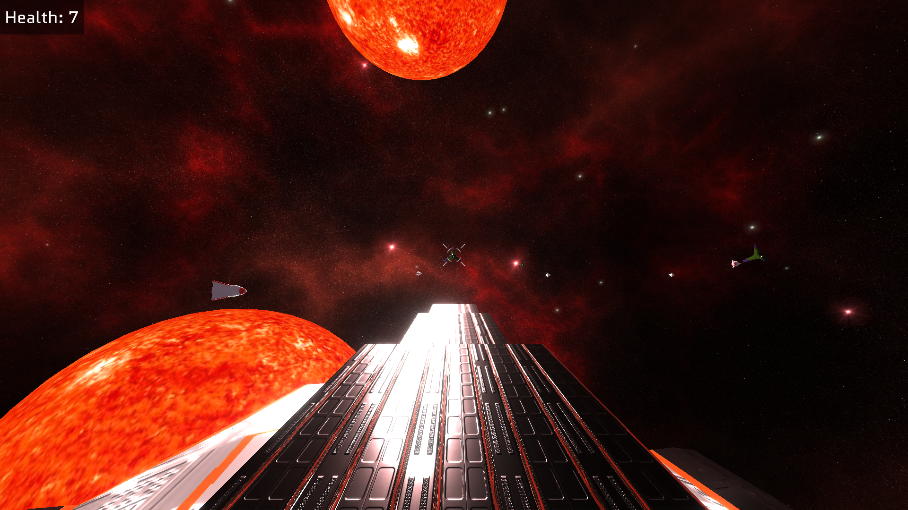

# Star Strike

A small game made in a couple of weeks using three.js

You can play the game in your browser [here](https://louistarvin.uk/star-strike/)

## How to play

**objective**: Destroy the enemy ships by shooting them. Avoid getting hit by enemy missiles.

There are two modes: flight mode and weapon mode. In flight mode you control the ship in a top-down view. In weapon mode you control the ship-mounted turret in a first-person view, but you cannot control the ship, leaving you vulnerable to enemy missiles.

### Controls

- Flight mode controls:
  - thrust: `W`
  - turn left/right: `A/D`
- Weapon mode controls:
  - look: `MOUSE`
  - shoot: `LEFT-CLICK`
- Toggle between flight and weapon mode: `SPACE`

## Screenshots

## Acknowledgements

- three.js: https://github.com/mrdoob/three.js
- Skyboxes: https://opengameart.org/content/space-skyboxes-0
- Background music: https://freesound.org/people/f-r-a-g-i-l-e/sounds/594068/
- Material textures and maps used for 3D models: https://3dtextures.me/
